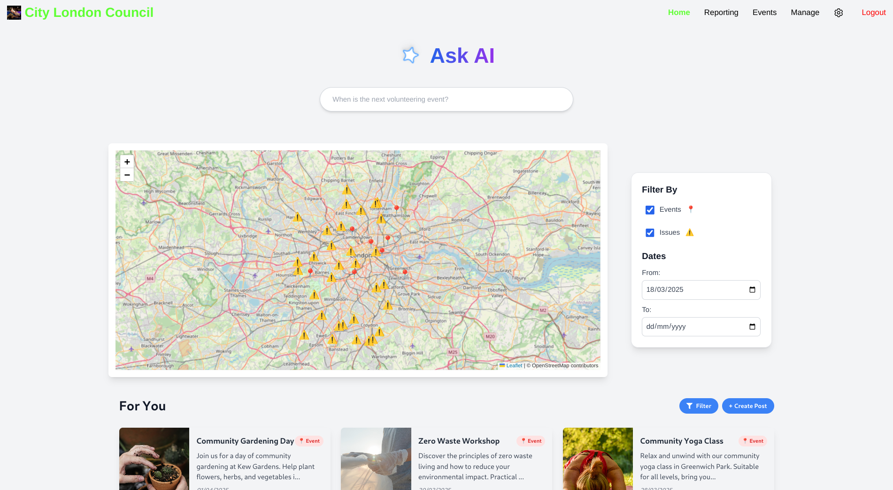

# Community Impact Report Portal In Partnership with NTTDATA

# Backend

## Run Development
- Make sure your [python](https://www.python.org/) version is 3.10 or 3.11 
- `cd backend`
- `python -m venv venv`
- **Activate the Virtual Environment**
    - (Linux/Mac) `source venv/bin/activate`
    - (Windows Powershell) `.\venv\Scripts\Activate`
    - (Windows Command Prompt) `venv\Scripts\activate`
- `pip install -r requirements.txt` 
    - These are our Python dependencies/libraries
    - Licences in ThirdPartyNotices.txt
- `python manage.py makemigrations`
- `python manage.py migrate`
- `python manage.py runserver`
- Backend should be up at the [127.0.0.1:8000](http://127.0.0.1:8000)

## Example Data (Optional)
Perform the following steps to populate the database with example data:
- Flush the current database (`python manage.py flush`) when the backend is not running.
- Run the backend (`python manage.py runserver`)
- From the backend folder:
    - `cd exampledata/`
    - `python automatic_example_data.py`

After running this script, as well as the frontend and backend, you'll be able to login with the following details:
- Username: ExampleBusiness
- Password: 1ExampleBusiness*

## Tests

### Unit Tests
- `python manage.py test`
### Coverage Report
- `coverage run manage.py test`
- `coverage html --omit="*/test*"  -i`
- Open `backend/htmlcov/index.html` to view coverage
### Linting
- `pylint --load-plugins pylint_django **/*.py`

## Documentation
- Available at pdocs/index.html
- To rebuild (from the backend folder run): `pdoc backend/ accounts/ articles/ events/ api/ comments/ companyinformation/ exampledata/ forums/ likes/ reportdiscussion/ reports/ search/  --output-dir pdocs`
- Any further created apps should also be included in the pdoc command (e.g: following on from `search/`)

# Frontend

## Run Development
- Make sure you have  [nodejs.org](https://nodejs.org/) installed.
- Duplicate `.env.example` in `frontend/` and rename it to `.env`
- `cd frontend`
- `npm install`
    - `package.json` is our libraries/dependencies for our React frontend
    - Licences in ThirdPartyNotices.txt
- `npm run dev`

## Tests

### Unit Tests
- `npm run test`
### Coverage Report
- `npm run coverage`
- Check coverage folder for index.html to view coverage
### Linting
- `npx eslint src --max-warnings=0`

*comp0016-systems-engineering-group-11-2024*